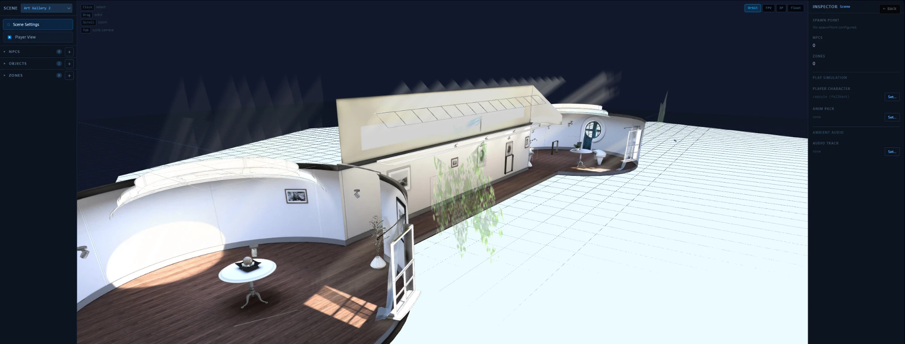

# threejs-engine-dev

A browser scene editor and walk-mode playground for Three.js. Author a room (terrain, placed GLB models,
NPCs, zones, spawn point, ambient audio), then walk it in first or third person. Built with Vue 3 on the
[`@base` packages](https://github.com/komogortev/vue-three-base-packages).

**[Live demo](https://komogortev.github.io/threejs-engine-dev/)** — runs in the browser; the editor works best on desktop.



> **Status:** active development. This is the workbench for the `@base` platform and the first release
> target, a manual scene and narrative authoring tool. Known gaps: placed objects are not solid yet, zones
> are exported but not read at runtime, and there are no path or animation triggers yet.

## What it does

- **Scenes** — list, open, import (ZIP) and delete scenes; they are stored in the browser (IndexedDB).
- **Editor** — orbit and bird's-eye camera, transform gizmos, terrain authoring, scatter zones, GLB placement,
  and a walk simulation on a session avatar.
- **NPCs** — shown as real models you can move, rotate and scale, with poses and animation clips from any
  animation kit.
- **Room player** — plays a built room with third- and first-person cameras from `@base/camera-three` and
  locomotion from `@base/player-three`; NPCs use the same placement rule as the editor.
- **Descriptors** — a scene is a `SceneDescriptor` that `SceneBuilder` turns into terrain, scatter, placed
  objects and an optional character.
- **Asset tooling** — headless Mixamo FBX to GLB conversion (no Blender needed).

## Run it locally

The app consumes the shared packages through `link:` dependencies, so the two repositories must sit side
by side. Needs Node 20 or newer and pnpm 9 or newer.

```bash
mkdir workspace && cd workspace
git clone https://github.com/komogortev/vue-three-base-packages SHARED
git clone https://github.com/komogortev/threejs-engine-dev
cd SHARED && pnpm install && pnpm build    # builds the @base/* packages
cd ../threejs-engine-dev && pnpm install && pnpm dev
```

- **Typecheck:** `pnpm run typecheck`
- **Production build:** `pnpm run build`
- **Production build for GitHub Pages:** set `VITE_BASE_PATH=/threejs-engine-dev/`, then `pnpm run build`
  (CI does this). Setup and troubleshooting: [docs/GITHUB-PAGES.md](./docs/GITHUB-PAGES.md).

## Tech stack

- Vue 3, Vue Router, Pinia, Vite 6, Tailwind, PWA (Vite PWA plugin)
- three.js, `@base/engine-core`, `@base/threejs-engine`, `@base/input`, `@base/player-three`,
  `@base/camera-three`, `@base/audio`

## Docs

- [PROJECT.md](./PROJECT.md) — vision and architecture
- [STATE.md](./STATE.md) — current state and known issues
- [PLAN-critical-path.md](./PLAN-critical-path.md) — critical path

## License

The source code is [MIT](./LICENSE) licensed. Third-party assets bundled under `public/` (for example the
Mixamo characters and animations and the Draco decoder) keep their own terms and are not covered by it.
